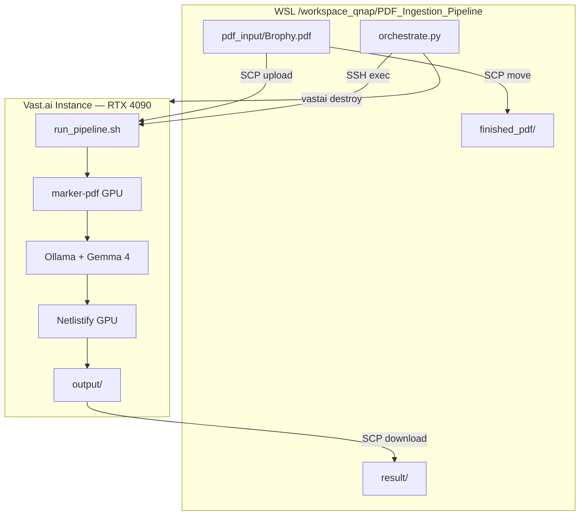

# Unified Cloud GPU Pipeline — Implementation Plan

## Arsitektur

## File yang Perlu Dibuat

| File | Fungsi |
|------|--------|
| `cloud_pipeline/run_pipeline.sh` | Entry script di GPU instance |
| `cloud_pipeline/vlm_local.py` | VLM via Ollama |
| `orchestrate.py` | Orchestrator lokal |

## Biaya

| Step | Time | Cost ($0.27/hr) |
|------|------|----------------|
| marker-pdf | 1 min | $0.005 |
| VLM describe | 20 min | $0.09 |
| Netlistify | 10 min | $0.05 |
| **Total** | **~31 min** | **~$0.15** |
